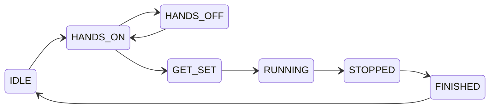

## GAN Smart Timer via Web Bluetooth API

This library is designed for easy interaction with GAN Smart Timer on the platforms that support [Web Bluetooth API](https://github.com/WebBluetoothCG/web-bluetooth/blob/main/implementation-status.md).

Nature of the GAN Smart Timer is event-driven, so this library is depends on [RxJS](https://rxjs.dev/) and provide [Observable](https://rxjs.dev/guide/observable) where you can subscribe for timer events.

#### Example usage:

```typescript
import { connectGanTimer, GanTimerState } from 'gan-web-bluetooth';

var conn = await connectGanTimer();

conn.events$.subscribe((timerEvent) => {
    switch (timerEvent.state) {
        case GanTimerState.RUNNING:
            console.log('Timer is started');
            break;
        case GanTimerState.STOPPED:
            console.log(`Timer is stopped, recorded time = ${timerEvent.recordedTime}`);
            break;
        default:
            console.log(`Timer changed state to ${GanTimerState[timerEvent.state]}`);
    }
});
```

You can read last times stored in the timer memory:
> Please note that you should not use `getRecordedTimes()` in polling fashion 
> to get currently displayed time. Timer and its bluetooth protocol does not designed for that.
```typescript
var recTimes = await conn.getRecordedTimes();
console.log(`Time on display = ${recTimes.displayTime}`);
recTimes.previousTimes.forEach((pt, i) => console.log(`Previous time ${i} = ${pt}`));
```

#### Possible timer states and their description:

State | Description
-|-
IDLE | Timer is reset and idle
HANDS_ON | Hands are placed on the timer
HANDS_OFF | Hands removed from the timer before grace delay expired
GET_SET | Grace delay is expired and timer is ready to start
RUNNING | Timer is running
STOPPED | Timer is stopped, this event includes recorded time
FINISHED | Move to this state immediately after STOPPED
DISCONNECT | Fired when timer is disconnected from bluetooth


#### Timer state diagram:


