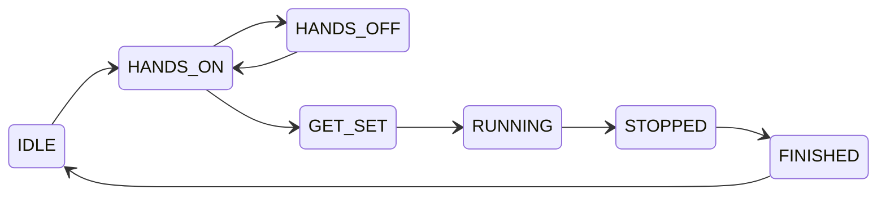

## Use of GAN Smart Timers & Smart Cubes via Web Bluetooth API

This library is designed for easy interaction with GAN Smart Timers and Smart Cubes 
on the platforms that support [Web Bluetooth API](https://github.com/WebBluetoothCG/web-bluetooth/blob/main/implementation-status.md).

Nature of the GAN Smart Timer and Smart Cubes is event-driven, so this library is
depends on [RxJS](https://rxjs.dev/), and library API provide [Observable](https://rxjs.dev/guide/observable) 
where you can subscribe for events.

## Installation

Package `gan-web-bluetooth` is available in the npm registry:

[](https://badge.fury.io/js/gan-web-bluetooth)

```
$ npm install gan-web-bluetooth
```

## GAN Smart Timers

Supported GAN timer devices:
- GAN Smart Timer
- GAN Halo Smart Timer

Sample application how to use this library with GAN Smart Timer can be found here:
- https://github.com/afedotov/gan-timer-display
- Live version: [GAN Timer Display](https://afedotov.github.io/gan-timer-display/)

Sample TypeScript code:
```typescript
import { connectGanTimer, GanTimerState } from 'gan-web-bluetooth';

var conn = await connectGanTimer();

conn.events$.subscribe((timerEvent) => {
    switch (timerEvent.state) {
        case GanTimerState.RUNNING:
            console.log('Timer is started');
            break;
        case GanTimerState.STOPPED:
            console.log(`Timer is stopped, recorded time = ${timerEvent.recordedTime}`);
            break;
        default:
            console.log(`Timer changed state to ${GanTimerState[timerEvent.state]}`);
    }
});
```

You can read last times stored in the timer memory:
> Please note that you should not use `getRecordedTimes()` in polling fashion 
> to get currently displayed time. Timer and its bluetooth protocol does not designed for that.
```typescript
var recTimes = await conn.getRecordedTimes();
console.log(`Time on display = ${recTimes.displayTime}`);
recTimes.previousTimes.forEach((pt, i) => console.log(`Previous time ${i} = ${pt}`));
```

#### Possible timer states and their description:

State | Description
-|-
IDLE | Timer is reset and idle
HANDS_ON | Hands are placed on the timer
HANDS_OFF | Hands removed from the timer before grace delay expired
GET_SET | Grace delay is expired and timer is ready to start
RUNNING | Timer is running
STOPPED | Timer is stopped, this event includes recorded time
FINISHED | Move to this state immediately after STOPPED
DISCONNECT | Fired when timer is disconnected from bluetooth


#### Timer state diagram:



## GAN Smart Cubes

Supported Smart Cube devices:
- GAN Gen2 protocol smart cubes:
  - GAN Mini ui FreePlay
  - GAN12 ui FreePlay
  - GAN12 ui
  - GAN356 i Carry S
  - GAN356 i Carry
  - GAN356 i 3
  - Monster Go 3Ai
- MoYu AI 2023 (this cube uses GAN Gen2 protocol)
- GAN Gen3 protocol smart cubes:
  - GAN356 i Carry 2
- GAN Gen4 protocol smart cubes:
  - GAN12 ui Maglev
  - GAN14 ui FreePlay

Sample application how to use this library with GAN Smart Cubes can be found here:
- https://github.com/afedotov/gan-cube-sample
- Live version: [gan-cube-sample](https://afedotov.github.io/gan-cube-sample/)

Sample TypeScript code:
```typescript
import { connectGanCube } from 'gan-web-bluetooth';

var conn = await connectGanCube();

conn.events$.subscribe((event) => {
    if (event.type == "FACELETS") {
        console.log("Cube facelets state", event.facelets);
    } else if (event.type == "MOVE") {
        console.log("Cube move", event.move);
    }
});

await conn.sendCubeCommand({ type: "REQUEST_FACELETS" });
```

Since internal clock of the most GAN Smart Cubes is not ideally calibrated, they typically introduce 
noticeable time skew with host device clock. Best practice here is to record timestamps of move events 
during solve using both clocks - host device and cube. Then apply linear regression algorithm 
to fit cube timestamp values and get fairly measured elapsed time. This approach is invented 
and firstly implemented by **Chen Shuang** in the **csTimer**. This library also contains `cubeTimestampLinearFit()` 
function to accomplish such procedure. You can look into the mentioned sample application code for details, 
and this [Jupyter notebook](https://github.com/afedotov/scipy-notebooks/blob/main/ts-linregress.ipynb) for visualisation
of such approach.

